# E-Shop

E-Shop is an eCommmerce platform built from scratch using the MERN stack and Redux. 

Using ___JWT___ and ___BCRYPT___, it allows for user registration and authentication so that users may shop, order and review online products. 

It is complete with Admin profile capability for basic order and payment tracking as well as product upload.

This project was built following the completion of Traversy Media's course on eCommerce and is intended to demonstrate foundational skills geared toward the design and development of eCommerce websites. 
<br>
<hr>
<br>

## Deployed Website

### Please click [here](https://afleming-portfolio.herokuapp.com/) to view the deployed website 
<br>
<hr>

## Installation

  <hr>
  
  **To edit/use the application, please follow the steps to pull the repository from GitHub through Git Bash and pull the script into VSCode, provided all three items are already installed on a local network.  It also requires Node.JS to be installed on the local network**

Installation steps are as follows:

1. Access the repository at [Git Hub] https://github.com/ad-fleming/E-Shop
2. Click on the code section (in green) and copy the SSH key.
3. Once the SSH key is copied, open the terminal through Git Bash.
4. Find or create the folder the user wants to work in and enter the following commands the the Git terminal:

   1. Clone the repoistory :

   ```
   git clone [copied link]
   ```

   (_this will allow access the repository to the local computer._)

   2. Open the reposity in VS code from git:

   ```
   code .
   ```

   (_This will extract the code and link the paths to VSCode for review/editing/uploading_)

   3. Install the modules and packages

   ```
   npm install
   ```

   (_In the the terminal, please run "npm install" (as the dependencie should be there) to download the modules necessary for this project to work._)

   4. Connect application with Mongo Database.

   ```

   ```

   5. Start the application

   ```
   npm run dev
   ```

   (_Once the modules are downloaded and the database is connected, please open up the terminal again and run "npm run dev"._)

<br/>

<br>

## Features
<hr>
E-Shop is built from the ground up using the MERN stack and Redux and comes with a number of essential features for any eCommerce site. 
<br>
<br>

### User Accounts
<br>
Users can either sign in, or register a new account in order to purchase products and leave product reviews. If a user attempts to order a product without an existing account, they will be prompted to create one.
<br>
<br>

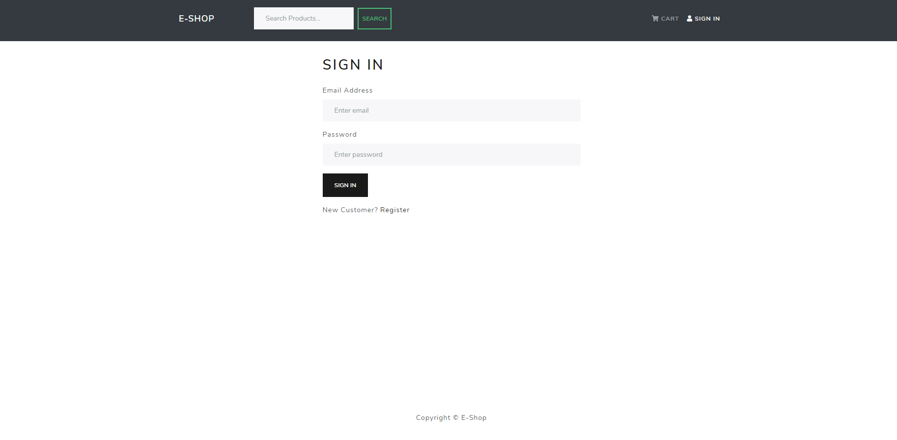

<br>
<br>

### Product List
<br>
E-shop's product list is displayed dynamically with built-in pagination as well as a top products carousel which updates autmatically based on customer reveiew data from the database. 

<br>
<br>

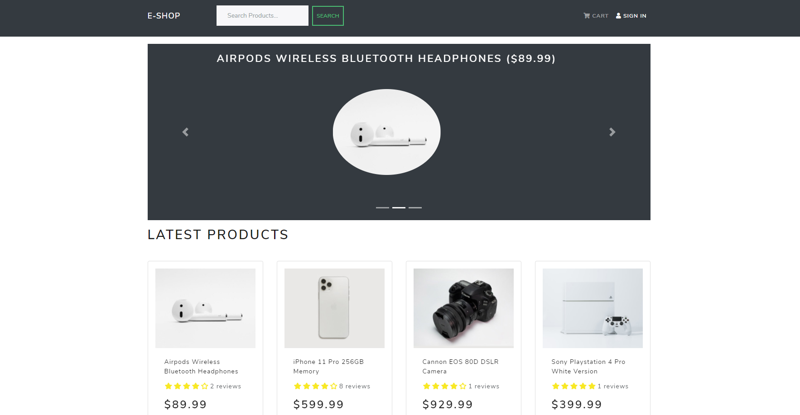


### Product Page
<br>

E-shop's single product page, dynamically pulls information from the database including the price, the number of items in stock, the product description and any customer reviews that have been left for that product. 

Additionally, if the user is signed in, the are presented with a form where they can review that particular product, as well as a button to add that item to their cart. 

E-Shop has built in validation to prevent users from leaving multiple reviews on the same product. 

<br>
<br>


## Shopping Cart
<br>

In its current state, E-Shop stores the users shopping cart in local storage, ensuring that items added to a user's cart will persist between sessions. The cart allows users to edit or delete items from their order and then to proceed to checkout. 

<br>
<br>

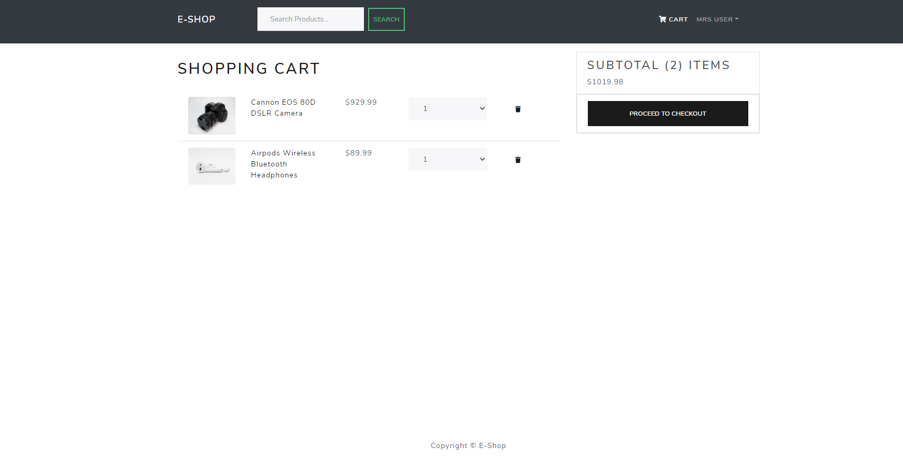


## Live Payments

E-Shop has the ability handle real transactions using the ___Paypal API__. Users will be prompted for their shipping address and payment method. Once the transaction is completed, they will see their order go from unpaid to paid. 

<br>
<br>

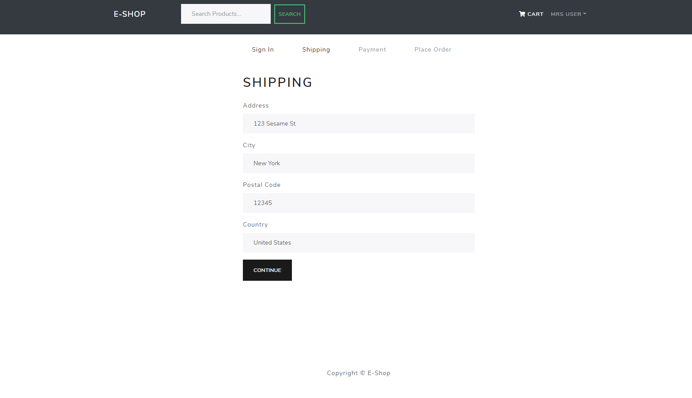

<br>

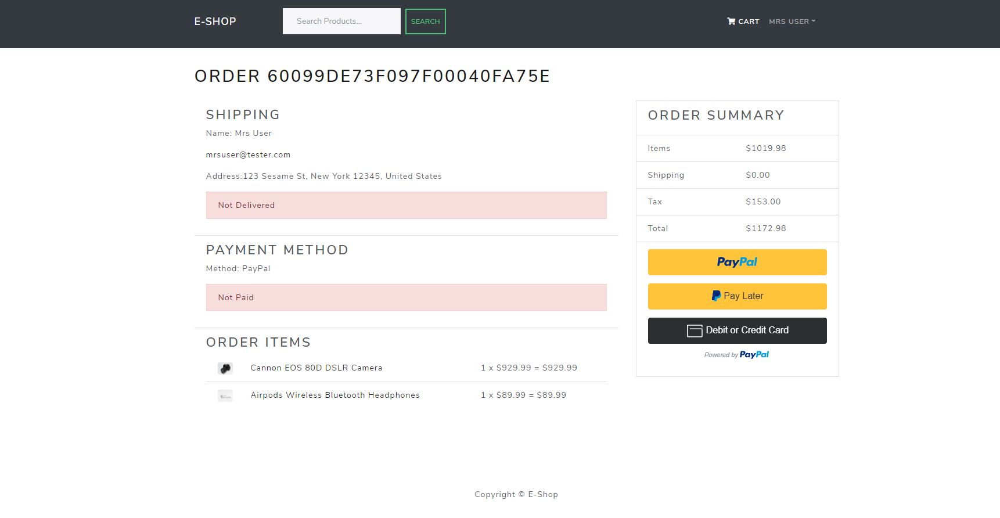

<br>

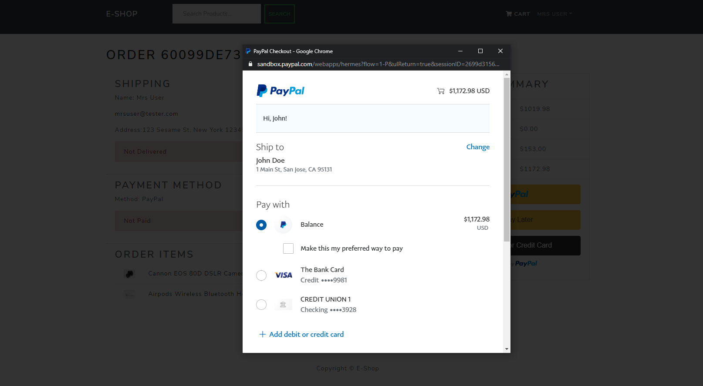

<br>

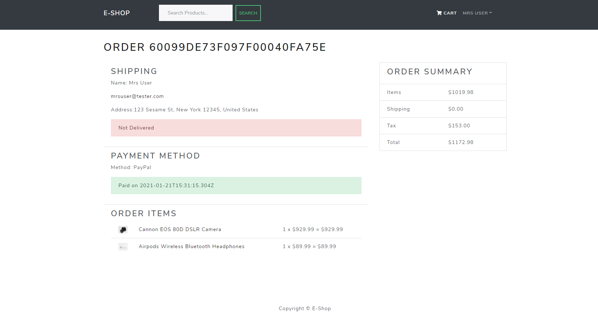

<br>

## Profile Management & Order Tracking
Users can access their profile via the drop down on the Nav Bar. Here they can make changes to their profile and see the status of the orders they have placed on the site. 

<br> 

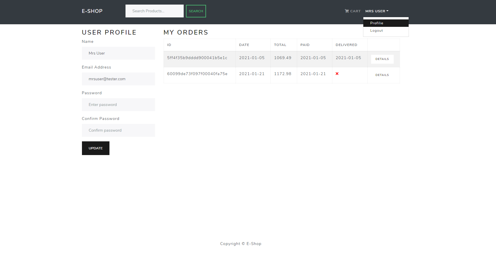

<br>
<br>


## Admin Features 
<hr>
Admins have a number of features available only to them. To access these features, they only need to access the drop down on the Nav Bar (this features only displays when an Admin account is logged in). Here, they can update, change and track users, products and orders. 

<br>

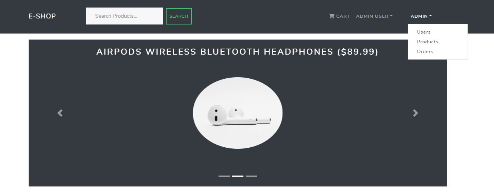

<br>

## User List

Admins are able to monitor users as well as update their profiles (including admin priveleges) from the user dashboard.

<br>

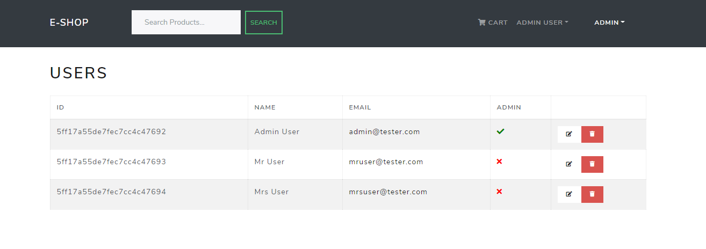

<br>

## Product Dashboard

Admins are able to monitor and update their products from the products dashboard. Here they can add, update and delete products from the database.

<br>

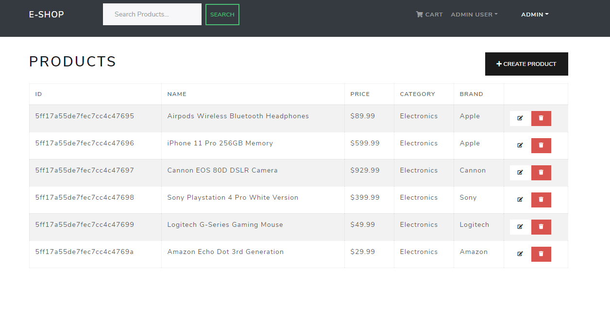

<br>

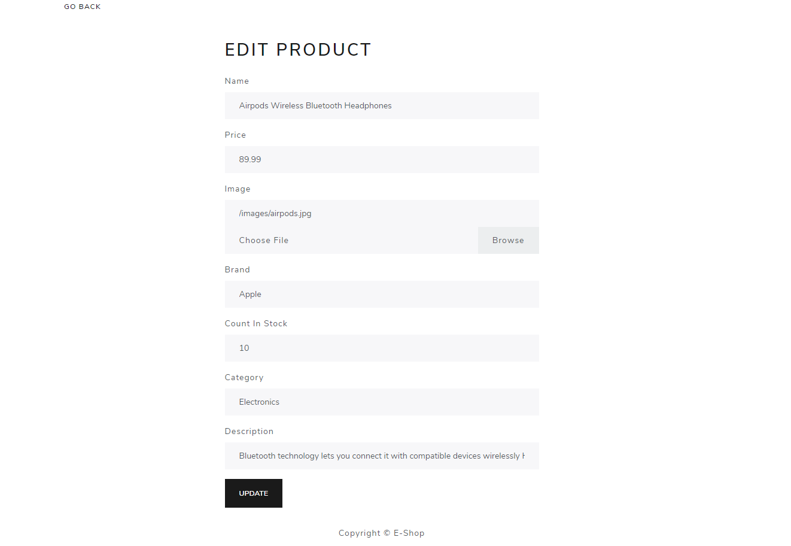

<br>

## Order Dashboard 

Lastly, admins have the ability to track their orders via the order dashboard. Here they can see all of their existing orders, as well as details for each individual order. They additionally have the ability to update a single order to a 'delivered' status which updates the order in the database. 

<br>

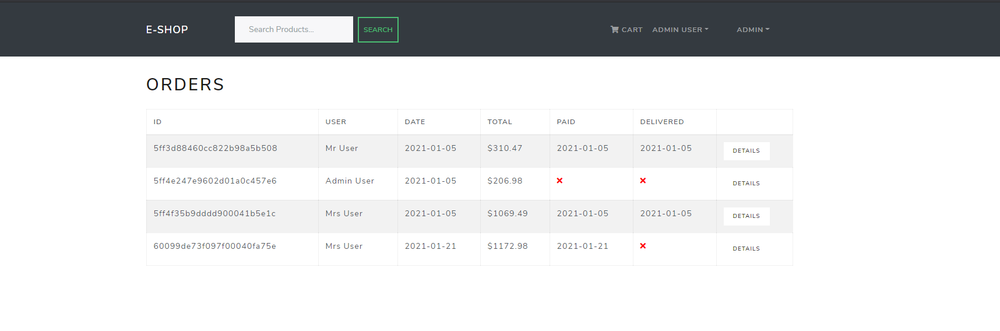

<br>

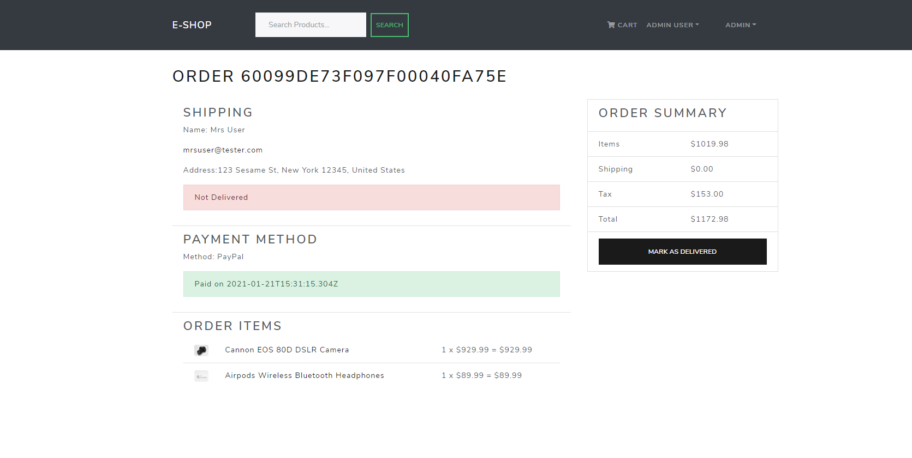

<br>

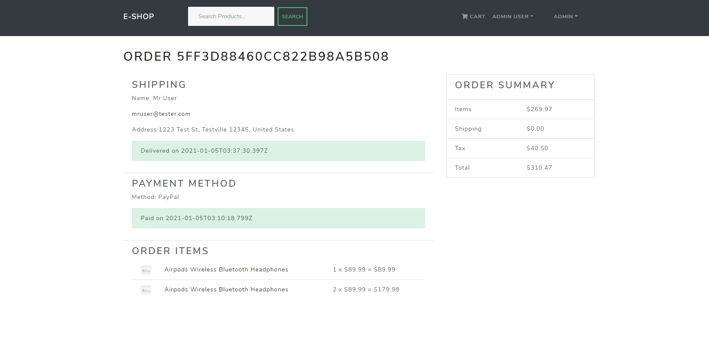

<br>

## Contributors
<hr>
<br>

I deployed this site following the completion of [Traversy Media's](https://www.traversymedia.com/) course for eCommerce. It is in effort to demonstrate my active pursuit and use of foundational skills neccessary to pursue employment as a Web Developer in 2021 and highlight my keen interest in developing eCommerce solutions.

If you have any questions or feedback I would love to hear from you. Additionally if you, or any one you know, are looking for a dedicated Junior Developer eager to accquire further skills and launch their career, please do reach out!

## Contact information

* Name - Alexander Fleming
* Email - adfleming9@gmail.com
* LinkedIn - https://www.linkedin.com/in/alexanderfleming0919/
* Personal Site - https://afleming-portfolio.herokuapp.com/

